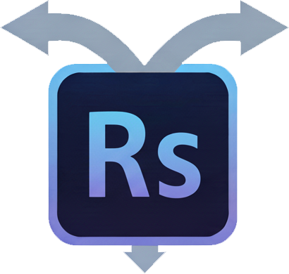
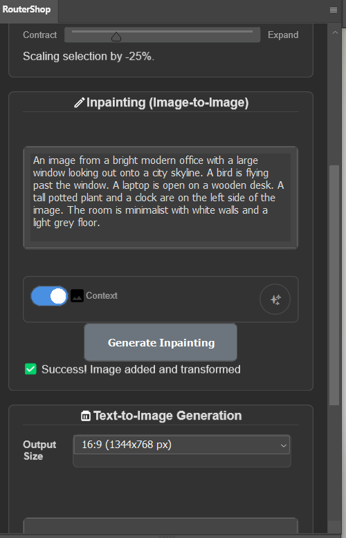
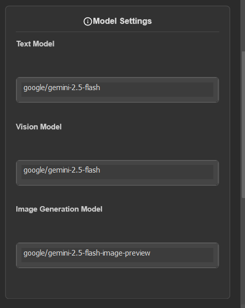
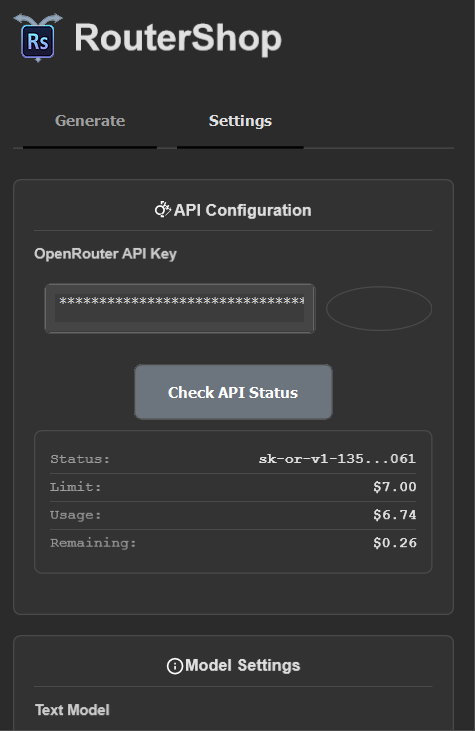

#  RouterShop

**AI-Powered Image Generation Plugin for Adobe Photoshop**

RouterShop is a powerful Adobe Photoshop plugin that brings cutting-edge AI image generation capabilities directly into your creative workflow. Leveraging the OpenRouter API, it enables seamless text-to-image generation and intelligent inpainting (image-to-image) transformations.


## ✨ Features

- **Text-to-Image Generation**: Create stunning images from text prompts with customizable aspect ratios
- **Intelligent Inpainting**: Transform selected areas of your images using natural language descriptions
- **Selection Tools**: Built-in selection creation and scaling tools for precise control
- **Smart Object Integration**: Automatically adds generated images as Smart Objects in Photoshop
- **API Status Monitoring**: Real-time monitoring of your OpenRouter API usage and limits
- **Settings Management**: Export/import settings for easy configuration across devices
- **Prompt Optimization**: AI-powered prompt enhancement for better results
- **Dark/Light Theme Support**: Adapts to your Photoshop interface theme

## 🚀 Installation

### Easy Method (Recommended for Users)
1. Download the `RouterShop.ccx` file from the [Releases](https://github.com/pwdgit/routershop/releases) page
2. Install Adobe Creative Cloud Desktop if you haven't already
3. Double-click the `.ccx` file to install the plugin
4. Launch Photoshop and find RouterShop in your Plugins panel

### Developer Method
1. Clone this repository:
   ```bash
   git clone https://github.com/pwdgit/routershop.git
   ```
2. Open Adobe UXP Developer Tool
3. Load the `src/manifest.json` file from the cloned project
4. The plugin will be available in Photoshop for development and testing

## 📖 Usage

### Getting Started
1. Open Photoshop and ensure you have a document active
2. Find the RouterShop panel in your Plugins menu
3. Go to the Settings tab and enter your OpenRouter API key
4. Click "Check API Status" to verify your connection

### Text-to-Image Generation


1. Switch to the "Generate" tab
2. Select your desired output size from the dropdown
3. Enter a descriptive prompt (e.g., "a serene mountain landscape at sunset")
4. Optionally enable "Context" to use your current image as reference
5. Click "Generate & Add Layer" to create the image

### Inpainting (Image-to-Image)


1. Make a selection in your Photoshop document
2. In the "Generate" tab, scroll to the Inpainting section
3. Enter a transformation prompt (e.g., "add a red dragon on the rock")
4. Optionally enable "Context" to include surrounding image information
5. Click "Generate Inpainting" to transform the selected area

### Selection Tools


- **Create Selection**: Choose from predefined aspect ratios (1:1, 2:3, 3:2, etc.)
- **Scale Selection**: Use the slider to expand or contract your selection
- **Selection Scaling**: Maintains center point while resizing

### Settings & Configuration


- **API Configuration**: Enter and manage your OpenRouter API key
- **Model Settings**: Configure text, vision, and image generation models
- **Prompt Optimization**: Customize the system prompt for AI-enhanced prompts
- **Settings Backup**: Export/import your configuration

## 🔧 Requirements

- Adobe Photoshop 2023 or later (minimum version 23.3.0)
- Valid OpenRouter API key (get one at [openrouter.ai](https://openrouter.ai))
- Internet connection for API calls

## 📄 License

This project is licensed under the MIT License - see the [LICENSE](LICENSE) file for details.

## 🙏 Acknowledgments

- Built with Adobe UXP for seamless Photoshop integration
- Powered by OpenRouter API for AI image generation
- Icons and UI designed for optimal user experience

---

**Made with ❤️ for the creative community**